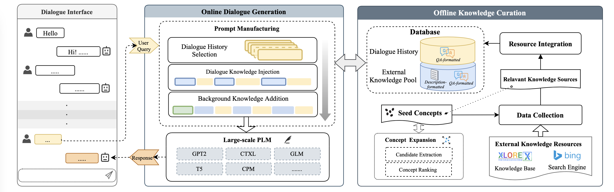
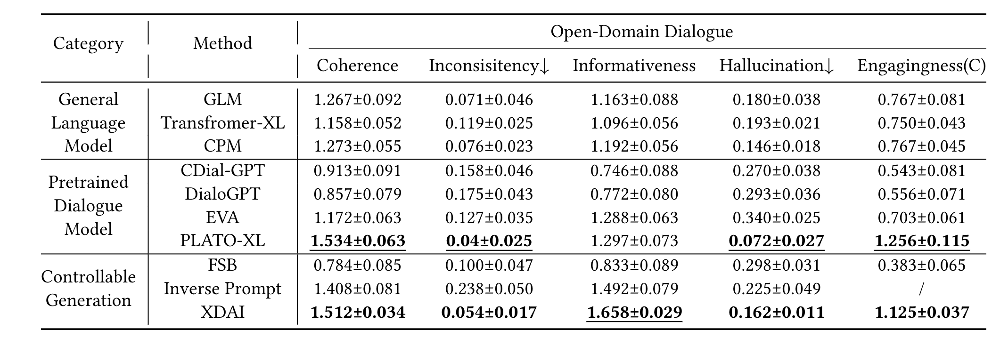
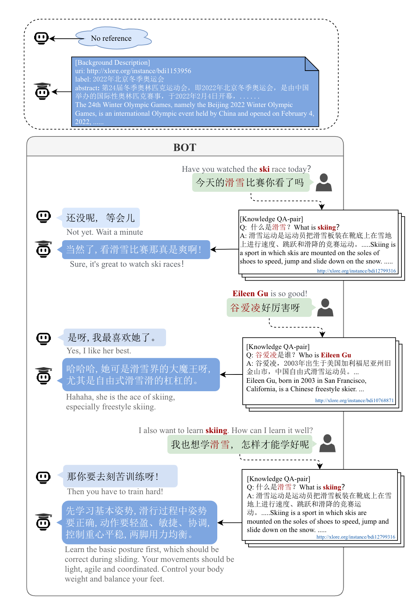

# XDAI

[Paper](https://dl.acm.org/doi/10.1145/3534678.3539135) 

XDAI is maintained by the Knowledge Engineering Group of Tsinghua University, and supported by Zhipu.AI & Biendata, which is a tuning-free framework for exploiting pre-trained language models in knowledge grounded dialogue. Employing large-scale models including [GLM](https://github.com/THUDM/GLM) and [CPM](https://github.com/TsinghuaAI/CPM-1-Generate), XDAI provides a basic open-domain dialogue generation service (XDAI-open) and several tools for developers in building domain-specific chatbots (XDAI-domain). 


We summarize the features of XDAI as follows:

* Quick Start:  XDAI provide an open-domain knowledge-grounded dialogue service with sufficient ready-to-use open-domain knowledge resources from [XLore2](https://www.xlore.cn/). Developers can easily deploy a dialogue system with this basic service.
* Efficient Inference：Compared with other dialogue systems, XDAI utilizes a novel prompt pattern with knowledge injection, which optimizes the generated dialogues from PLMs without further training or tuning.
* Customized Deployment: For domain-specific developers XDAI provides easy-to-change plugins to enable automatically searching and updating the external knowledge only from a few domain-specific seeds. 
* Incremental Modification: XDAI also  provides a series of toolkits for incremental developing, encouraging developers to refine and customize their personalized components. 

## News ‼️

* Our paper "[XDAI: A Tuning-free Framework for Exploiting Pre-trained Language Models in Knowledge Grounded Dialogue Generation]( https://dl.acm.org/doi/10.1145/3534678.3539135)" have been accepted by KDD2022 Applied Data Science track!!
* The XDAI service can be now experienced via our demo [website](https://models.aminer.cn/xdai/). You can try to interact with different characters and DIY your own “小呆”（nickname of XDAI) and "take it home" from our Wechat Official Account: "[小呆爱聊天](https://github.com/THUDM/XDAI/blob/main/pics/xdai_qrcode.jpg)".

<div align=center>

</div>

* The XDAI domain-specific knowledge exploration toolkits are refined !!
* More Language models are accessible now !!

* Our paper is submitted to KDD2022 Applied Data Science track !!

## Architecture

The overall architecture of XDAI is shown as bellow.



XDAI consists of two subsystems: online dialogue generation system & offline knowledge curation. 
Developers can employ their own toolkits and chatbot servers for local implementation.


### Toolkit

####  PLM API (GLM)
You can deploy your own PLM server by taking the following steps.
We offer the pack of *GLM* version in `tools/PLM`
1. Setup the environment (refer to https://github.com/THUDM/GLM). 
2. Modify the `[PLM]`section in `config/conf.ini`:
    ```ini
    [PLM]
    ip_address = <server_ip>
    glm_port = <self-defined available port>
    glm_api = http://{ip_address}:{glm_port}/glm
    ```
   and set the `"load_pretrained"` in the `tools/PLM/GLM/glm_config.json` to be path-to-your-model.
3. Start the server by running:   
    ```shell
    bash tools/deploy_plm.sh
    ```
4. If you use ready-made API, just set `glm_api=<ready-made-PLM-api>` and then add the corresponding function in `module/use_plm`

#### Knowledge Explore
While open-corpus is available, it is also encouraged to setup your own knowledge base.

The knowledge exploration toolkit at `tools/knowledge` is based on https://github.com/luogan1234/concept-expansion-snippet 

Run the script to initiate model:
```shell
bash tools/init_knowledge_explore.sh
```
You can set the topic and seed concepts in `data/seed_concept.json`, and run the task:

```shell
# For init seed concepts
python tools/knowledge/explore.py -t init -f tools/knowledge/data/seed_concept.json
# For periodic knowledge exploration 
python tools/knowledge/explore.py -t update -f tools/knowledge/data/seed_concept.json -i 1 
```
The parameters are:
```text
-t,--task:  init | update
-f,--config_file: config of the specific topic
-i,--interval: if the task is "update", this set the interval days between two consecutive updates.
```
#### FAQ toolkit
If you deploy your own knowledge exploration module as described above, you have to build a retrieval service.

We provide a faq toolkit based on `fuzzybert` which can be attached to the mongodb you use.
Modify the `faq_port` in `TOOL` section in `config/conf.ini` and start the service:
```shell
bash tool/deploy_faq.sh
```

#### Sentence similarity
Modify the `sentsim_port` in `TOOL` section in `config/conf.ini` and start the service:
```shell
bash tool/deploy_sentsim.sh
```
You can also change the `sbert-model` referring to https://huggingface.co/models?library=sentence-transformers


#### QA-generation (based on T5)
If you want to use T5-based question generation instead of template-based, you have to build a generation service, which is based on https://github.com/patil-suraj/question_generation.

We provide a QA-gen toolkit, and you should modify the `qagen_port` in `TOOL` section in `config/conf.ini` and start the service:
```shell
bash tool/deploy_t5QA.sh.sh
```

Notice that `transformer==3.0.0` is required by the source code.
This question generation code only supports English question generation, so we use youdao translation for English-Chinese translation, which is implemented in `utils/translate.py`. 
This translation interface has a sending limit. If you need to use it, please replace it with your own translation interface.
## Get Started

#### 1. Requirements
```
pip install -r requirements.txt
```
#### 2. Set up PLM API

Get a ready-made PLM generation api or deploy one with the toolkit mentioned above.

#### 3. Design your Bot Agent
An agent class corresponds to an independent processing flow of prompt manufacturing, which should be derived from the base class in `agents/agent_base.py`:
```python
from agents import AgentBase

class YourOwnAgent(AgentBase):
    ...
```
You can add agent classes in `agents/`. There are three derived subclasses as examples.
```shell
agents/
├── agent_base.py
├── __init__.py
├── xdai_glm.py
├── xdai_kg.py
└── xdai_kg_specific.py
```
- `xdai_glm.py`: The baseline implementation without knowledge injected using GLM as the PLM.
- `xdai_kg.py`: GLM + open knowledge injected using [XLore2](https://www.xlore.cn/)
- `xdai_kg_specific.py`:GLM + specific domain knowledge with self-maintained FAQ db.

After being added, a new class should then be imported in the `agents/__init__.py` and appended to `IN_USE_AGENTS`
#### 4. Interact
The following 3 methods of deployment are offered to interact with the chatbot:
1. **Terminal**: The simplest way to expeirence the dialogue system, which does not require the api server as the prerequisite.
```shell
bash scripts/run_terminal_chat.sh
```
2. **Streamlit**: It is started with some backend apis deployed. Run the bash:
```shell
bash scripts/run_streamlit.sh
```
For more information & instruction : https://docs.streamlit.io/ 

3. **Wechaty**: 

Link the chatbot to your wechat account, with backend server required as well.
Before start, you need to get a token from http://wechaty.js.org/ and set the token in `conf.ini`.
Then you can run:
```shell
bash scripts/run_wechaty.sh
```

## Analysis & Example

XDAI can achieve competitive results in both open-domain and domain-specific dialogue scenarios. The table shows 95% confidence intervals for human evaluation results of open-domain dialogue generation.



There is a case of how the explored knowledge help lifting the informativeness of generated dialogues.



## Reference
```
    @inproceedings{10.1145/3534678.3539135,
    author = {Yu, Jifan and Zhang, Xiaohan and Xu, Yifan and Lei, Xuanyu and Guan, Xinyu and Zhang, Jing and Hou, Lei and Li, Juanzi and Tang, Jie},
    title = {XDAI: A Tuning-Free Framework for Exploiting Pre-Trained Language Models in Knowledge Grounded Dialogue Generation},
    year = {2022},
    isbn = {9781450393850},
    publisher = {Association for Computing Machinery},
    address = {New York, NY, USA},
    url = {https://doi.org/10.1145/3534678.3539135},
    doi = {10.1145/3534678.3539135},
    abstract = {Large-scale pre-trained language models (PLMs) have shown promising advances on various downstream tasks, among which dialogue is one of the most concerned. However, there remain challenges for individual developers to create a knowledge-grounded dialogue system upon such big models because of the expensive cost of collecting the knowledge resources for supporting the system as well as tuning these large models for the task. To tackle these obstacles, we propose XDAI, a knowledge-grounded dialogue system that is equipped with the prompt-aware tuning-free PLM exploitation and supported by the ready-to-use open-domain external knowledge resources plus the easy-to-change domain-specific mechanism. With XDAI, the developers can leverage the PLMs without any fine-tuning cost to quickly create the open-domain dialogue systems as well as easily customize their own domain-specific systems. Extensive experiments including human evaluation, Turing test, and online evaluation have demonstrated the competitive performance of XDAI compared with the state-of-the-art general PLMs and specific PLMs for dialogue. XDAI pilots studies on the exploitation of PLMs and made intriguing findings which could be inspiring for the future research on other PLM-based applications.Developers and related researchers can get access to our repository at https://github.com/THUDM/XDAI, which presents a series of APIs, incremental toolkits and chatbot service of XDAI platform.},
    booktitle = {Proceedings of the 28th ACM SIGKDD Conference on Knowledge Discovery and Data Mining},
    pages = {4422–4432},
    numpages = {11},
    keywords = {dialogue systems, pre-trained model exploitation},
    location = {Washington DC, USA},
    series = {KDD '22}
    }
```
